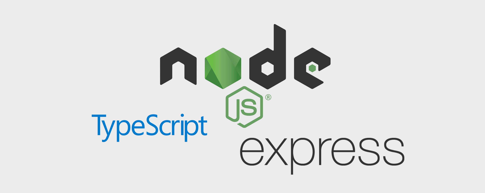

<h1 align="center">
  
</h1>


## 🗄️ NodeJS, TypeScript and Express template

This template is made for building new APIs with these technologies and includes:

- TypeScript runtime configuration
- ESLint preferences(AirBnB style)
- Prettier config for better linting
- Project folder tree based on standards
- Pre-configured ORM(TypeORM) with User model
- JWT authentication
- Routes template
- Upload file configuration

## 📥️ Dependencies

- bcryptjs
- dotenv
- express
- express-async-errors
- jsonwebtoken
- multer
- ora
- reflect-metadata
- typeorm
- uuidv4

## 📑 How to install

Clone this repository and open the project, next install the dependencies:

```bash
yarn install
```

Write your personal configurations on a ***.env*** file based on ***.env.example***, create your database and run the migrations:

```bash
yarn typeorm migration:run
```

Now you are ready to code!

## 📖 License

See the <a href="./LICENSE.md">LICENSE</a> file for more details.


<h4 align="center" style="margin-top: 20px; border-top: 1px solid #eee; padding-top: 20px;">Made with ❤️ by <strong>Joao Victor Farias</strong> </h4>